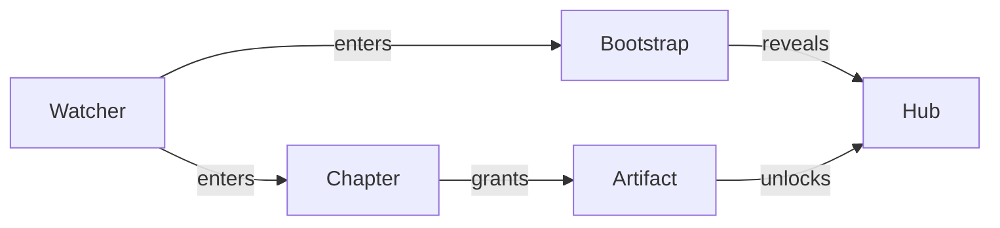
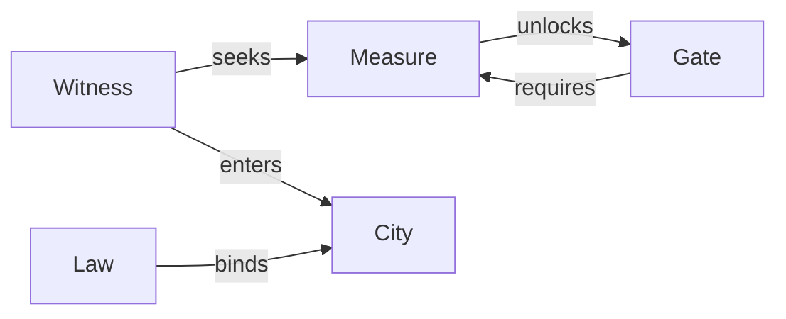
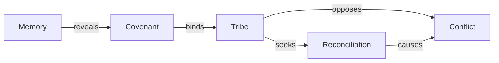

# Character Progression Templates

Status: Canonical Template Set (v1)

Purpose: provide reusable progression diagrams that can be encoded directly as semantic graph artifacts and shared across worlds.

Template bundle file:
- `narrative_data/templates/character_progression_templates.json`

## 1) Watcher Bootstrap Loop

Template id:
- `tpl_watcher_bootstrap_loop_v1`

## 2) Witness Gate City

Template id:
- `tpl_witness_gate_city_v1`

## 3) Tribe Reconciliation Arc

Template id:
- `tpl_tribe_reconciliation_arc_v1`

## Encoding Rule

A progression diagram is treated as a semantic artifact template when represented as:

- `nodes[]`
- `edges[]`
- `transitions[]`

with stable ids, canonical predicate names, and replay-safe transition operations.

## Usage (runtime)

1. Load a template from `character_progression_templates.json`.
2. Optional: rename node labels for a specific chapter/world.
3. Materialize as `semantic_graph_artifact`.
4. Emit materialization event (`semantic_graph_materialized`) for replay traceability.
5. Share via projection package export/import.

## Decentralized Collaboration Bridge

These templates are meant to be copied, specialized, and re-encoded by independent collaborators while preserving canonical graph shape and replay semantics.
